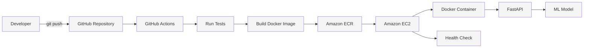
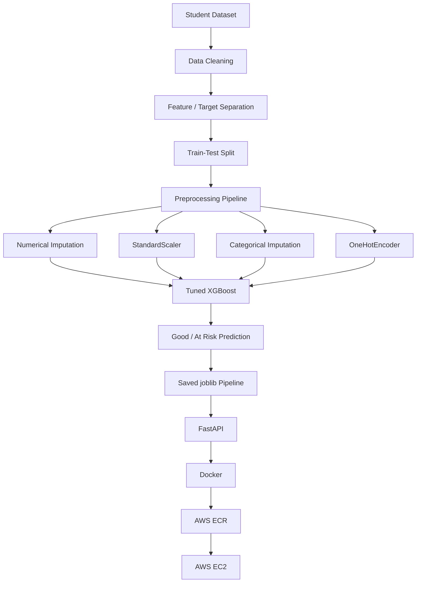
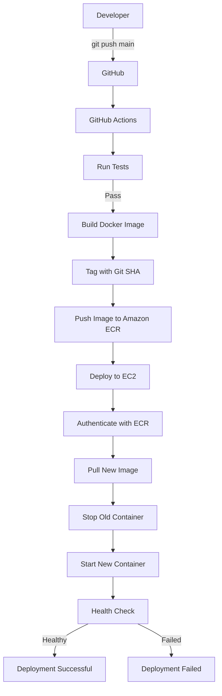

# Student Performance Prediction — End-to-End AWS ML Deployment

An end-to-end Machine Learning project that predicts whether a student is **Good** or **At Risk** based on academic and demographic information.

The project covers the complete ML lifecycle:

**Data → Preprocessing → Model Training → Evaluation → FastAPI → Docker → Amazon ECR → EC2 → GitHub Actions CI/CD → Automated Deployment**

---

## Table of Contents

- [Project Overview](#project-overview)
- [Objectives](#objectives)
- [Architecture](#architecture)
- [Dataset](#dataset)
- [Machine Learning Pipeline](#machine-learning-pipeline)
- [Model Performance](#model-performance)
- [Why Tuned XGBoost](#why-tuned-xgboost)
- [Project Structure](#project-structure)
- [API](#api)
- [Dockerization](#dockerization)
- [AWS Deployment](#aws-deployment)
- [CI/CD Pipeline — Step 15](#cicd-pipeline--step-15)
- [Full Deployment Automation — Step 16](#full-deployment-automation--step-16)
- [Security](#security)
- [How to Run Locally](#how-to-run-locally)
- [How the Complete Pipeline Works](#how-the-complete-pipeline-works)
- [Future Improvements](#future-improvements)
- [Skills Demonstrated](#skills-demonstrated)

---

## Project Overview

This project demonstrates how a trained Machine Learning model can be converted into a production-style REST API and deployed on AWS.

The model predicts student performance using a binary classification problem:

- `Good`
- `At Risk`

The trained model is packaged together with its preprocessing pipeline using `joblib`. A FastAPI application exposes the model through a REST API. The application is containerized using Docker and the image is stored in Amazon Elastic Container Registry (ECR).

GitHub Actions is used for CI/CD. Every push to the `main` branch triggers automated testing, Docker image creation, and ECR deployment.

The final automation stage is designed to automatically deploy the new ECR image to an EC2 instance and perform a health check.

---

## Objectives

1. Build a complete Machine Learning classification pipeline.
2. Compare multiple ML algorithms.
3. Tune the best-performing model.
4. Save the complete preprocessing + model pipeline.
5. Build a REST API using FastAPI.
6. Containerize the API using Docker.
7. Push Docker images to Amazon ECR.
8. Deploy the application on Amazon EC2.
9. Implement CI/CD using GitHub Actions.
10. Automate deployment from ECR to EC2.
11. Perform a post-deployment health check.

---

# Architecture

## Overall Architecture



> The `style` lines are optional. GitHub's Mermaid renderer may display the diagram without custom styling.

## ML Architecture



---

# Dataset

The project uses the **UCI Student Performance Dataset**.

The dataset contains student information and academic attributes such as:

- School
- Sex
- Age
- Study time
- Failures
- Absences
- Family information
- Parental education
- Internet access
- Previous grades
- Final grade

The original dataset contains **649 instances** and includes **G1, G2, and G3** grade variables.

### Target Transformation

The project converts the prediction problem into binary classification:

```text
Good     → 1
At Risk  → 0
```

The target distribution used for modeling was:

```text
Good     : 265
At Risk  : 130
```

> Note: The original UCI dataset documentation points out that G1 and G2 are strongly correlated with G3. This project therefore treats the target definition and feature selection as important parts of the modeling process.

---

# Machine Learning Pipeline

## 1. Data Loading

The dataset is loaded and inspected for:

- Missing values
- Data types
- Feature distributions
- Target distribution
- Categorical and numerical features

## 2. Feature Engineering / Target Creation

The original performance information is converted into a binary classification target.

## 3. Train-Test Split

The dataset is divided into training and testing subsets.

The test set is kept separate so that final model performance can be evaluated on unseen data.

## 4. Preprocessing

The preprocessing pipeline handles both numerical and categorical features.

### Numerical Features

```text
Missing-value imputation
        ↓
StandardScaler
```

### Categorical Features

```text
Missing-value imputation
        ↓
OneHotEncoder
```

The preprocessing and model are combined into one pipeline so that the exact same transformations are applied during training and prediction.

---

# Models Compared

The following approaches were evaluated:

1. Dummy Classifier baseline
2. Logistic Regression
3. Random Forest
4. XGBoost
5. Tuned XGBoost

## Model Comparison

| Model | Accuracy | Precision | Recall | F1 Score | ROC-AUC |
|---|---:|---:|---:|---:|---:|
| Dummy Baseline | 0.671 | 0.000 | 0.000 | 0.000 | 0.500 |
| Logistic Regression | 0.696 | 0.571 | 0.308 | 0.400 | 0.715 |
| Random Forest | 0.709 | 0.615 | 0.308 | 0.410 | 0.694 |
| XGBoost | 0.709 | 0.579 | 0.423 | 0.489 | 0.702 |
| **Tuned XGBoost** | **0.759** | **0.684** | **0.500** | **0.578** | **0.744** |

### Best Model

**Tuned XGBoost**

```text
Accuracy : 75.95%
Precision: 68.42%
Recall   : 50.00%
F1 Score : 57.78%
ROC-AUC  : 74.38%
```

### Classification Report

```text
              precision    recall  f1-score   support

Good             0.78      0.89      0.83        53
At Risk          0.68      0.50      0.58        26

accuracy                              0.76        79
macro avg        0.73      0.70      0.70        79
weighted avg     0.75      0.76      0.75        79
```

---

# Why Tuned XGBoost?

XGBoost was selected because it performed better than the other tested models, particularly in terms of recall and F1 score for the minority `At Risk` class.

Hyperparameter tuning was then performed to improve model performance.

## Best Hyperparameters

```text
learning_rate    = 0.1
max_depth        = 4
n_estimators     = 300
subsample        = 0.7
colsample_bytree = 1.0
```

The final model is stored together with its preprocessing pipeline.

```text
models/student_performance_model.joblib
```

This avoids having to manually reproduce preprocessing during API inference.

---

# Project Structure

```text
student-performance-ml/
│
├── api/
│   ├── main.py
│   ├── requirements.txt
│   └── ...
│
├── data/
│   └── ...
│
├── models/
│   └── student_performance_model.joblib
│
├── notebooks/
│   └── ...
│
├── tests/
│   └── ...
│
├── Dockerfile
├── .dockerignore
├── .gitignore
├── README.md
└── .github/
    └── workflows/
        └── ci-cd.yml
```

---

# API

The trained model is served through **FastAPI**.

## Health Endpoint

```http
GET /health
```

Example response:

```json
{
  "status": "healthy",
  "service": "student-performance-api",
  "model": "tuned-xgboost"
}
```

This endpoint is also used as a deployment verification mechanism.

## Prediction Endpoint

```http
POST /predict
```

The endpoint accepts student feature data and returns a prediction.

Example response structure:

```json
{
  "prediction": "Good",
  "probability": 0.82
}
```

> The exact request schema depends on the features defined in `api/main.py`.

---

# Dockerization

The FastAPI application is packaged as a Docker image.

## Docker Workflow

```text
Application Code
      ↓
Dockerfile
      ↓
Docker Build
      ↓
Docker Image
      ↓
Amazon ECR
      ↓
Amazon EC2
      ↓
Running Container
```

The Docker container includes:

- FastAPI
- Uvicorn
- Python dependencies
- ML dependencies
- Saved ML model
- API source code

---

# AWS Deployment

## AWS Services Used

| Service | Purpose |
|---|---|
| Amazon ECR | Docker image registry |
| Amazon EC2 | Application hosting |
| IAM | Access control |
| GitHub Actions | CI/CD automation |
| AWS STS / OIDC | Secure GitHub authentication |

### AWS Region

```text
ap-south-1
```

### ECR Repository

```text
student-performance-api
```

### ECR Registry

```text
<AWS_ACCOUNT_ID>.dkr.ecr.ap-south-1.amazonaws.com
```

---

# CI/CD Pipeline — Step 15

Step 15 implements the first major part of CI/CD.

When code is pushed to the `main` branch:

```text
git push
   ↓
GitHub Actions
   ↓
Checkout code
   ↓
Set up Python
   ↓
Install dependencies
   ↓
Run pytest
   ↓
Build Docker image
   ↓
Authenticate with AWS
   ↓
Login to ECR
   ↓
Push Docker image to ECR
```

## GitHub Actions Workflow

The workflow uses:

- `actions/checkout`
- `actions/setup-python`
- `aws-actions/configure-aws-credentials`
- `aws-actions/amazon-ecr-login`

The Docker image is tagged using the Git commit SHA.

Example:

```text
student-performance-api:<github-commit-sha>
```

This provides immutable image versioning and makes it possible to identify exactly which commit produced a deployed image.

## GitHub → AWS Authentication

The pipeline uses **OIDC (OpenID Connect)** rather than storing long-lived AWS access keys in GitHub.

The GitHub Actions IAM role is:

```text
arn:aws:iam::<AWS_ACCOUNT_ID>:role/<GITHUB_ACTIONS_ROLE>
```

The trust policy restricts access to the project repository and branch.

---

# Full Deployment Automation — Step 16

## Why Step 16?

Step 15 automates:

```text
GitHub → Tests → Docker → ECR
```

But ECR is only the image registry.

The EC2 instance still needs to obtain and run the new image.

Step 16 completes the deployment pipeline:

```text
GitHub
   ↓
GitHub Actions
   ↓
Tests
   ↓
Docker Build
   ↓
Amazon ECR
   ↓
EC2 automatically pulls image
   ↓
Old container stopped
   ↓
New container started
   ↓
Health check
```

This is the **full end-to-end CI/CD deployment flow**.

> Step 16 is the planned automation stage unless the EC2 deployment workflow has already been implemented and tested.

---

## Step 16.1 — Prepare EC2

The EC2 instance should have:

- Docker installed
- AWS CLI installed
- Network access to Amazon ECR
- An IAM role attached to the instance

The EC2 instance should use an IAM role rather than storing static AWS credentials.

Verify the role:

```bash
aws sts get-caller-identity
```

The result should identify the AWS account and the EC2-assumed IAM role.

---

## Step 16.2 — EC2 ECR Permissions

The EC2 IAM role needs permission to pull private ECR images.

Required ECR operations include:

```text
ecr:GetAuthorizationToken
ecr:BatchCheckLayerAvailability
ecr:BatchGetImage
ecr:GetDownloadUrlForLayer
```

The AWS managed policy:

```text
AmazonEC2ContainerRegistryPullOnly
```

can be attached to the EC2 role for this purpose.

---

## Step 16.3 — Authenticate EC2 with ECR

On EC2:

```bash
aws ecr get-login-password --region ap-south-1 | \
docker login --username AWS --password-stdin \
<AWS_ACCOUNT_ID>.dkr.ecr.ap-south-1.amazonaws.com
```

Expected result:

```text
Login Succeeded
```

---

## Step 16.4 — Deployment Script

A deployment script can be placed on EC2.

Conceptually, it performs:

```text
1. Authenticate with ECR
2. Pull the requested image
3. Stop the current container
4. Remove the old container
5. Start the new container
6. Wait for startup
7. Check /health
8. Report success/failure
```

Example deployment flow:

```bash
docker pull <ECR_IMAGE>

docker stop student-performance-api || true
docker rm student-performance-api || true

docker run -d \
  --name student-performance-api \
  -p 80:8000 \
  <ECR_IMAGE>

curl http://localhost/health
```

The final script should be adapted to the actual EC2 port and Docker configuration used by the project.

---

# Step 16.5 — GitHub Actions Automatic Deployment

After the ECR push succeeds, the GitHub Actions workflow can trigger the EC2 deployment.

Final workflow:

```text
test
  ↓
build
  ↓
push-to-ecr
  ↓
deploy-to-ec2
```

The deployment job should:

1. Identify the image created from the current Git commit.
2. Connect to EC2 securely.
3. Run the deployment script.
4. Wait for the container to start.
5. Perform the health check.
6. Fail the workflow if the application is unhealthy.

---

# Step 16.6 — Pull the New Image

The EC2 deployment uses the exact Git SHA image produced by GitHub Actions.

Example:

```text
<AWS_ACCOUNT_ID>.dkr.ecr.ap-south-1.amazonaws.com/student-performance-api:<GITHUB_SHA>
```

Using the Git SHA rather than `latest` provides better traceability.

```text
Git commit
    ↓
Git SHA
    ↓
Docker tag
    ↓
ECR image
    ↓
EC2 deployment
```

---

# Step 16.7 — Restart the FastAPI Container

The deployment script replaces the old container with the new version.

```text
Old Container
     ↓
Stop
     ↓
Remove
     ↓
Pull New Image
     ↓
Start New Container
```

The application then runs the new model/API version.

---

# Step 16.8 — Post-Deployment Health Check

After deployment, the pipeline should verify:

```http
GET /health
```

Expected:

```json
{
  "status": "healthy",
  "service": "student-performance-api",
  "model": "tuned-xgboost"
}
```

If the health check fails, the GitHub Actions deployment job should fail.

This prevents a successful Docker push from being treated as a successful application deployment.

---

# Step 16.9 — Complete Automated Pipeline

Once Step 16 is implemented, the final architecture becomes:



---

# Step 16.10 — Rollback Protection

A production-style improvement is to retain previous image versions.

Because images are tagged with Git commit SHAs:

```text
student-performance-api:commit-A
student-performance-api:commit-B
student-performance-api:commit-C
```

If the latest deployment fails, the previous known-good image can be redeployed.

Example concept:

```text
Current:  commit-C
Previous: commit-B

If C fails
     ↓
Rollback
     ↓
Deploy commit-B
```

This is safer than relying only on a mutable `latest` tag.

---

# Security

The project avoids storing long-lived AWS access keys in GitHub Actions.

## GitHub Actions

Authentication uses:

```text
GitHub OIDC
      ↓
AWS IAM Role
      ↓
Temporary AWS credentials
```

## EC2

EC2 uses:

```text
EC2 IAM Role
      ↓
Temporary AWS credentials
      ↓
ECR Pull
```

This follows the principle of using IAM roles and temporary credentials instead of hard-coded AWS access keys.

---

# How to Run Locally

## 1. Clone the Repository

```bash
git clone https://github.com/your-username/student-performance-ml.git
cd student-performance-ml
```

## 2. Create a Virtual Environment

Windows:

```powershell
python -m venv venv
venv\Scripts\activate
```

Linux/macOS:

```bash
python3 -m venv venv
source venv/bin/activate
```

## 3. Install Dependencies

```bash
pip install -r api/requirements.txt
```

## 4. Start FastAPI

Depending on the application structure:

```bash
uvicorn api.main:app --reload
```

## 5. Open API Documentation

```text
http://localhost:8000/docs
```

The Swagger UI can be used to test the prediction endpoint interactively.

---

# Run with Docker

Build the image:

```bash
docker build -t student-performance-api .
```

Run the container:

```bash
docker run -d \
  --name student-performance-api \
  -p 8000:8000 \
  student-performance-api
```

Check the API:

```text
http://localhost:8000/health
```

Swagger:

```text
http://localhost:8000/docs
```

---

# How the Complete Pipeline Works

A developer only needs to make a code change and push it:

```bash
git add .
git commit -m "Update model/API"
git push origin main
```

Then automation takes over.

### Stage 1 — Continuous Integration

```text
GitHub
   ↓
GitHub Actions
   ↓
Install dependencies
   ↓
Run tests
```

If tests fail:

```text
Pipeline stops
```

If tests pass:

```text
Continue
```

### Stage 2 — Build and Registry

```text
Docker Build
   ↓
Git SHA Tag
   ↓
Amazon ECR
```

### Stage 3 — Continuous Deployment

```text
ECR
   ↓
EC2
   ↓
Pull image
   ↓
Restart container
   ↓
Health check
```

### Final Result

```text
git push
   ↓
Automated testing
   ↓
Automated Docker build
   ↓
Automated ECR push
   ↓
Automated EC2 deployment
   ↓
Automated health check
```

This is the complete end-to-end deployment lifecycle.

---

# Future Improvements

Possible next improvements include:

- Add model monitoring
- Add CloudWatch logging
- Add CloudWatch alarms
- Add HTTPS using a domain and reverse proxy
- Add AWS Application Load Balancer
- Add autoscaling
- Add blue-green deployment
- Add automated rollback
- Add model version tracking
- Add experiment tracking with MLflow
- Add unit and integration test coverage
- Add data validation
- Add model drift detection
- Add infrastructure as code using Terraform
- Add a frontend dashboard

---

# Skills Demonstrated

## Machine Learning

- Supervised Learning
- Binary Classification
- Data Preprocessing
- Feature Engineering
- Model Comparison
- Hyperparameter Tuning
- XGBoost
- Model Evaluation
- Precision / Recall / F1
- ROC-AUC

## Python

- Pandas
- NumPy
- Scikit-learn
- XGBoost
- Joblib
- FastAPI
- Pytest

## DevOps / MLOps

- Docker
- Docker image versioning
- REST API deployment
- CI/CD
- GitHub Actions
- GitHub OIDC
- AWS IAM
- Amazon ECR
- Amazon EC2
- Automated deployment
- Health checks
- Deployment rollback strategy

## Cloud

- AWS
- Amazon ECR
- Amazon EC2
- IAM
- STS
- OIDC authentication

---

# Project Highlights

- End-to-end ML project from dataset to cloud deployment
- Tuned XGBoost classifier achieving **75.95% test accuracy**
- REST API built with FastAPI
- Dockerized ML application
- Docker images stored in Amazon ECR
- Application hosted on Amazon EC2
- GitHub Actions CI/CD pipeline
- GitHub OIDC used for secure AWS authentication
- Git SHA-based Docker image versioning
- Planned full ECR → EC2 automatic deployment
- Post-deployment health-check architecture
- Rollback-ready image versioning strategy

---

# Author

**Project Author**

BSc IT — Artificial Intelligence & Machine Learning

GitHub: `your-username`

Repository: `student-performance-ml`
---

## License

This project is intended for educational and portfolio purposes
